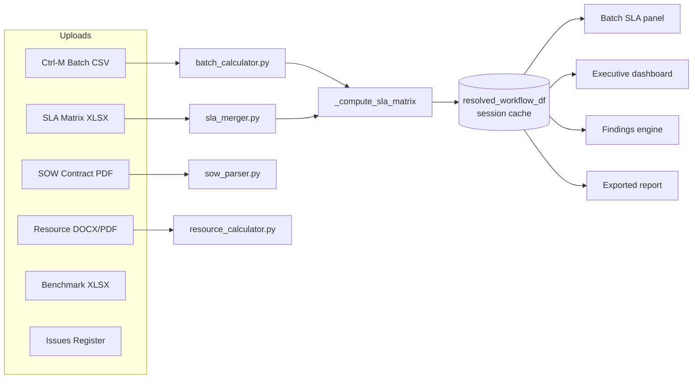
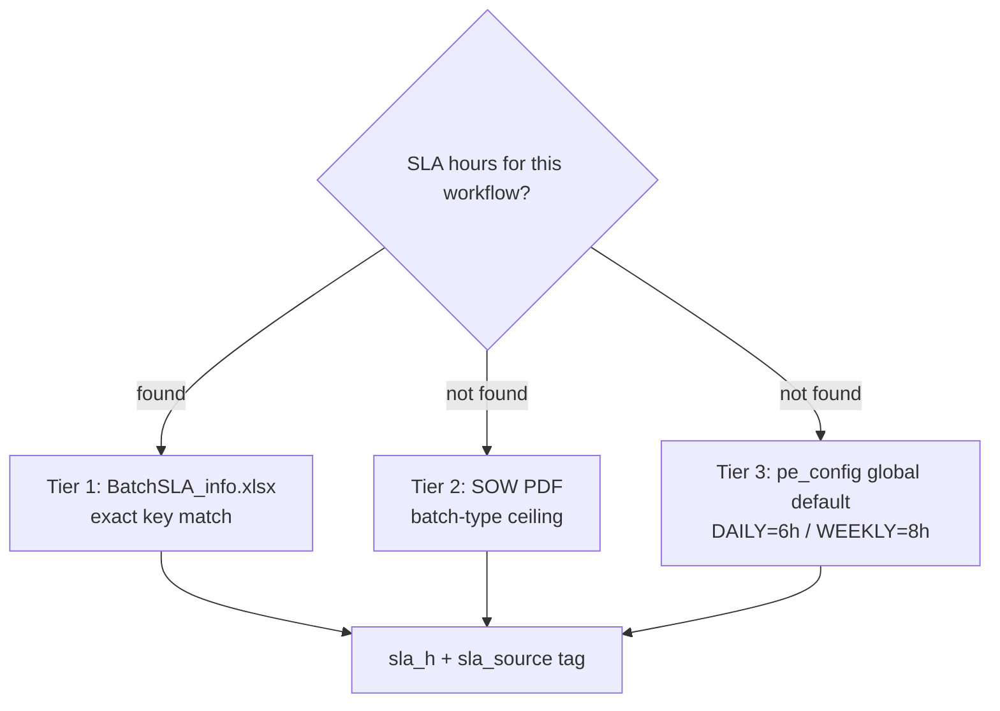
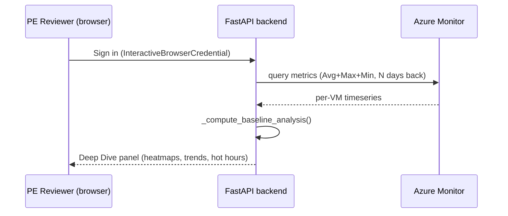
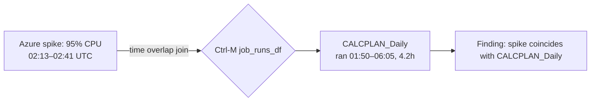

<!-- 
HOW TO USE THIS FILE
1. Install the "Marp for VS Code" extension → open this file → click "Open Preview
   to the Side" to present directly, or use the Marp status-bar icon → Export to
   PPTX/PDF (needs the Marp CLI, one-time: npm install -g @marp-team/marp-cli).
2. Or just copy each "---"-separated section into PowerPoint manually — the
   headings/bullets below map 1:1 to slide title/body.
3. Speaker notes are the italic lines starting with "Talk track:" under each
   slide — delete before printing, keep for delivery.
-->

# PE Audit Dashboard
### Architecture, Formulas & Azure-Correlated SLA Intelligence

A single source of truth for Performance Engineering audits across 250–300
customer engagements.

*Talk track: open by framing this as "how we replaced a manual, spreadsheet-driven
audit with one deterministic pipeline that never disagrees with itself."*

---

## Agenda

1. The problem this replaces
2. Tech stack
3. Architecture — one pipeline, six data pillars
4. SLA resolution logic + the buffer formula
5. Pulling & correlating Azure resource metrics
6. Cross-source correlation formulas (RFCS / SRI / JRTOS / CRS / OSHS)
7. SOW contract vs. actual volume
8. Findings engine (automated audit rules)
9. Governance, export & sign-off
10. Roadmap / Q&A

---

## The Problem

- Legacy process: a Streamlit monolith + manual cross-referencing of Ctrl-M
  exports, SLA spreadsheets, SOW PDFs, and Azure portal screenshots
- Every customer has **different DFU/SKU/SLA values** — no two engagements
  are alike, so hardcoded thresholds silently produce wrong verdicts
- Metrics were **recomputed independently on each screen** → two panels could
  show two different compliance numbers for the same job
- No repeatable link between "batch job breached its window" and
  "the VM was under CPU/memory pressure at that exact time"

*Talk track: this is the "why" slide — it justifies the single-source-of-truth
design and the correlation formulas that follow.*

---

## Tech Stack

| Layer | Technology |
|---|---|
| Backend | FastAPI + Python 3.14, Pydantic v2 |
| Frontend | Vanilla JS (ES2020+), Tailwind v3, Chart.js + Plotly.js |
| AI (optional) | Google Gemini (narrative generation, findings text) — toggleable, deterministic engine works with it fully off |
| Azure | `azure-identity`, `azure-monitor-query`, `azure-mgmt-compute/resource/subscription` |
| Data processing | pandas, numpy, openpyxl, PyMuPDF, python-docx, pypdf |
| Persistence | Flat JSON (`.pe_config.json` thresholds, `.pe_cache.json` session) — no external DB dependency |

*Talk track: no framework lock-in on the frontend, no DB server to provision —
the whole tool runs from one Python process, easy to deploy per-engagement.*

---

## Architecture — One Pipeline, Six Data Pillars

**Rule: every screen reads from `resolved_workflow_df`. No screen recomputes
its own metrics.** This is the single fact that prevents panel-to-panel
disagreement.

---

## Six Data Pillars

| Pillar | Source file | What it contributes |
|---|---|---|
| Batch | Ctrl-M CSV | Job runtimes, start/end, failures |
| Resource | DOCX/PDF fleet report | CPU/mem/disk per server |
| SLA Matrix | XLSX (BatchSLA_info) | Contracted SLA hours per workflow — **Tier 1** |
| SOW Contract | PDF | Contracted DFU/SKU volumes, batch-window ceilings — **Tier 2** |
| Benchmark | XLSX | Transaction/UI performance thresholds |
| Issues Register | XLSX/CSV | Open tickets cross-referenced against findings |

*Talk track: each pillar is optional — the dashboard degrades gracefully and
tells the PE reviewer exactly which pillar is missing, rather than guessing.*

---

## SLA Resolution — Tiered, Never Hardcoded

- Every workflow key is normalized before lookup:
  `_norm(name)` = strip environment prefix (`PROD_`/`TEST_`/`UAT_`/`DEV_`/`STG_`)
  → uppercase. Same function mirrored in JS as `_normWf()` — a single naming
  convention across backend and frontend.
- **Every value carries provenance**: `sla_source`, `reason_code`,
  `debug_runtime_source` — a reviewer can always see *why* a number is what it is.

---

## The Buffer Formula (used everywhere)

$$
\text{bufferPct} = \frac{\text{SLA hours} - \text{runtime hours}}{\text{SLA hours}} \times 100
$$

| Condition | Status |
|---|---|
| `buffer_pct > 40%` | **OK** |
| `15% < buffer_pct ≤ 40%` | **LONG_JOB** (getting close) |
| `0% < buffer_pct ≤ 15%` | **AT_RISK** |
| `buffer_pct ≤ 0%` | **BREACH** |

- Thresholds (`SLA_ATRISK_PCT=15`, `SLA_LONGJOB_PCT=40`) live in **one file**
  (`pe_config.py`) — every consumer (SLA matrix, compliance engine, findings
  engine, frontend legend) reads the same constant, never a hardcoded copy.
- Division-by-zero guarded (`np.nan` → `fillna(-100)`) so a zero-hour SLA
  never silently renders as `inf%`.

---

## Pulling Azure Resource Metrics

- Auth: `InteractiveBrowserCredential` (no `DefaultAzureCredential` — banned,
  it hangs 30s+ probing IMDS on non-Azure machines). Sign in once, silently
  restored from a local auth-record cache on reload/restart.
- One Azure Monitor query per VM requests **AVERAGE + MAXIMUM + MINIMUM in a
  single call** for CPU / Memory / Disk / Data-Disk-Bandwidth — not three
  separate round trips.
- A brief spike that would average away to nothing over a 7/15/30-day window
  is preserved via the Max series — critical for catching short nightly-batch
  CPU spikes that a daily average hides.

---

## Azure Baseline Intelligence

`_compute_baseline_analysis()` turns raw timeseries into judgment-grade
evidence (needs ≥ 2 days of data, **15 days recommended**):

| Signal | What it detects |
|---|---|
| Hot hours | Consistent pressure at the same clock hour → batch fingerprint |
| Trend acceleration | Metric getting worse across the observation window |
| Weekday vs weekend divergence | Batch-driven load vs. steady-state load |
| Chronic pressure | High utilization for many consecutive days → undersized VM |
| Multi-day recurring spikes | Same hour spiking on N different days → definitive batch signature |
| Fleet-wide trend | Roll-up across all VMs for an executive verdict |

*Talk track: this is what upgrades a finding's evidence class from "inferred"
to "measured" — Azure telemetry corroborating a Ctrl-M-only observation.*

---

## Correlating Batch, SLA & Resource — 5 Formulas

`services/correlation_engine.py` — the cross-pillar math no single-source
tool can do, because it needs both Ctrl-M **and** Azure Monitor data:

| Formula | Meaning |
|---|---|
| **RFCS** (0–100) | Resource-Failure Correlation Score — how much resource stress lines up with job failures |
| **SRI** (0–∞) | SLA Risk Index per job — buffer distance amplified by CPU pressure |
| **JRTOS** (per hour 0–23) | Job-Resource Temporal Overlap — which hour of day is riskiest |
| **CRS** (0–1) | Cascade Risk Score — likelihood a breach cascades downstream |
| **OSHS** (0–100 → A–F) | Overall System Health Score — executive-dashboard grade |

---

## Formula Detail

$$
\text{RFCS} = \text{failureRate} \times \frac{0.6\cdot\text{avgCPU} + 0.4\cdot\text{avgMem}}{100} \times \big(1 + 0.15 \times \min(\text{criticalServers},10)\big)
$$

$$
\text{SRI} = \frac{\text{peakHours}}{\text{slaCeilingHours}} \times \Big(1 + \max\big(0, \tfrac{\text{avgCPU}-70}{100}\big)\Big) \quad (>1.0 = \text{breach})
$$

$$
\text{CRS} = \text{failedFlag} \times \frac{\text{downstreamCount}}{\text{downstreamCount}+5} \times \Big(1 - \tfrac{\text{slaBuffer}}{100}\Big)
$$

$$
\text{OSHS} = 0.40\cdot\text{batchScore} + 0.35\cdot\text{slaScore} + 0.25\cdot\text{resourceScore}
$$

*Talk track: these feed the Executive Dashboard's letter grade — the one
number a customer sponsor actually looks at.*

---

## Spike-to-Batch Attribution (the unique correlation)

For every Azure Monitor spike (critical / critical-sustained / warning
severity only), find which Ctrl-M jobs were **running during that exact
window**:

- Join condition: `run.start < spike.end AND run.end > spike.start`
- Explicitly labeled **time-coincidence, not host-pinned causation** — Ctrl-M
  exports carry no host column today. Ranked by job runtime, top-N surfaced
  per spike.
- *(Upgrade path already scaffolded: once a job→VM map exists, the same join
  narrows to genuine host-pinned causation with one filter added.)*

---

## SOW Contract vs. Actual Volume

- SOW PDF parsed for contracted **DFU/SKU/order volumes** and **batch-window
  ceilings** (Gemini-assisted extraction with hard bounds validation: SLA
  windows 0.5–48h, volumes 1–50M, availability 90–100% — out-of-range values
  are rejected, never silently accepted).
- Actual volume (from Batch/manual entry) compared against the SOW baseline:

$$
\text{pct} = \frac{\text{actual}}{\text{SOW contracted}} \times 100
$$

| Band | Status |
|---|---|
| `< SOW_UNDER_PCT` | **LOW** — under-utilized vs. contract |
| `90% – SOW_OVER_PCT` | **OPTIMAL** |
| `> SOW_OVER_PCT` | **OVER** |
| `> SOW_OVER_CRIT_PCT` | **CRITICAL_OVER** — blocks PE sign-off without disclaimer |

*Talk track: this is what tells a customer "you're running 53% under your
contracted daily volume" or "you've exceeded scope and need a change order."*

---

## Findings Engine — 14 Automated Rule Sections

1. Data confidence / audit coverage
2. Batch rules (R0–R8): compliance, window breach, buffer, anomalies
3. Resource rules: fleet grade, CPU/mem/disk pressure bands
4. Cross-source: batch breach + CPU pressure correlation
5. SLA Matrix: per-run, tightest buffer, repeat offenders
6. Benchmark: threshold breaches, worst transactions
7. SOW compare: exceeded / under / optimal
8. Regression: z-score > 2σ critical, 1.5–2σ drift warning
9. Adaptive SLA: p95 within 10% of ceiling
10. Issues register cross-reference
11. Intelligence (A1–A10): misleading-green detection, waiver detection, contradictions
12. Narrative + open audit gaps

*Talk track: every rule cites its evidence — a job name, a number, a
timestamp — never a generic "performance issue detected."*

---

## Governance, Export & Sign-off

- PE reviewer checklist gates sign-off on data completeness
- Blockers can be overridden with an explicit, logged disclaimer — never
  silently bypassed
- One-click **HTML report export**: pulls Batch, Resource, SLA, SOW,
  Benchmark, Findings, and Approval sections from the same
  `resolved_workflow_df` / session cache the live dashboard uses — the report
  a customer receives is provably the same numbers the reviewer saw on screen

---

## Roadmap / Q&A

- Host-pinned spike attribution (once job→VM mapping is available)
- Wider AI narrative coverage (Findings/Executive Summary sections in export)
- Additional Azure metrics (already extensible — one query call per metric group)

### Questions?
