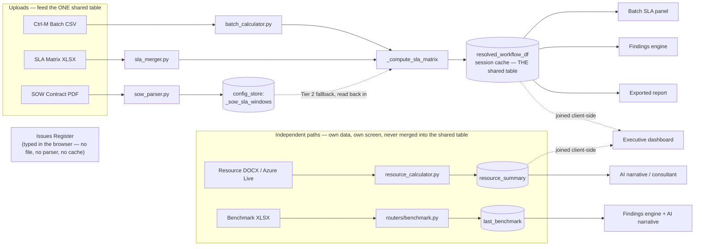
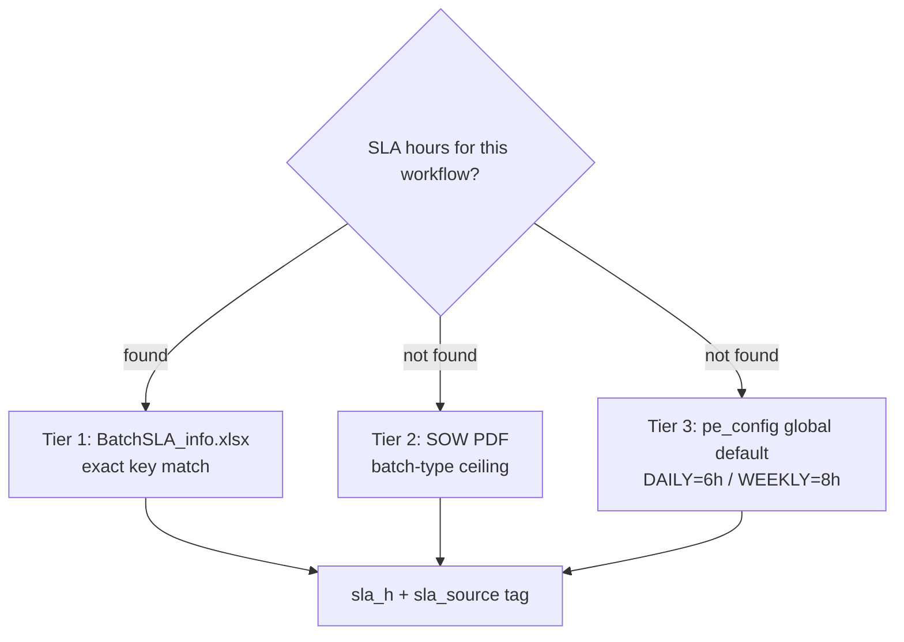
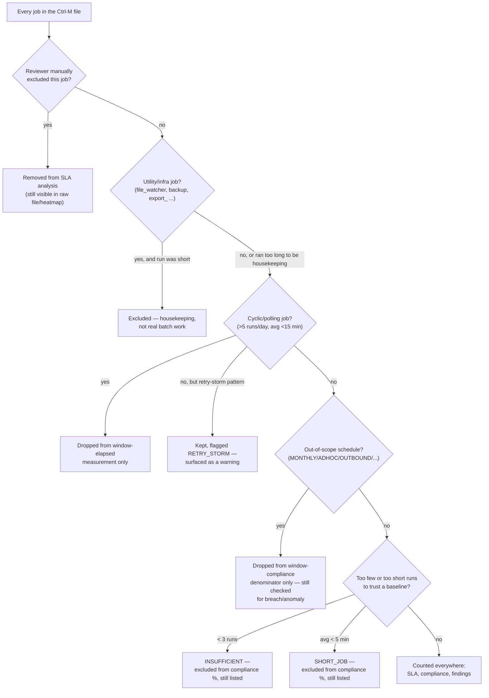
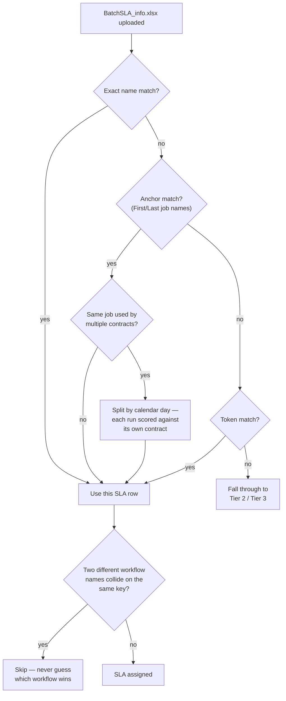
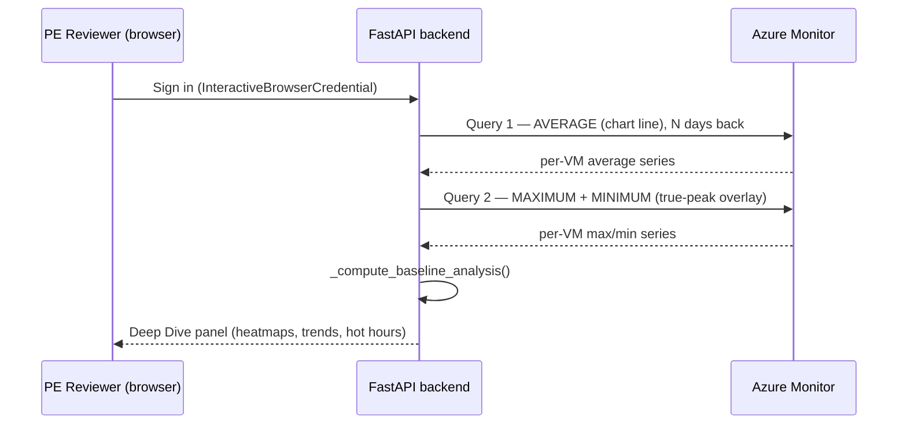
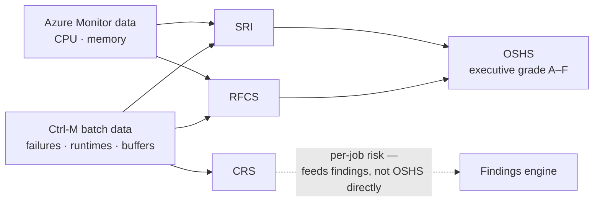
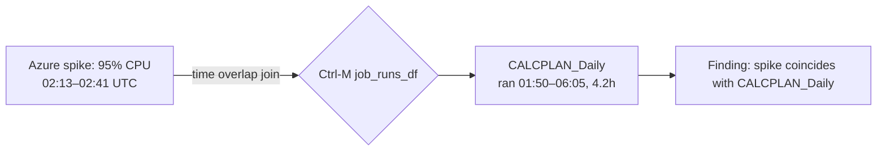
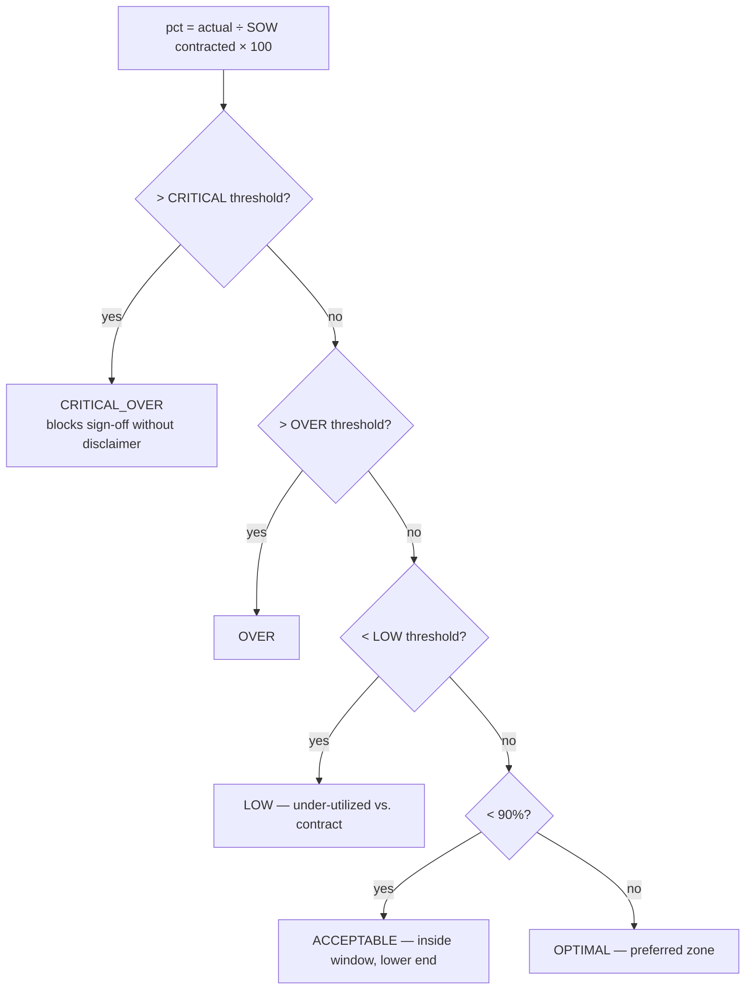

<!-- 
HOW TO USE THIS FILE
1. Install the "Marp for VS Code" extension → open this file → click "Open Preview
   to the Side" to present directly, or use the Marp status-bar icon → Export to
   PPTX/PDF (needs the Marp CLI, one-time: npm install -g @marp-team/marp-cli).
2. Or just copy each "---"-separated section into PowerPoint manually — the
   headings/bullets below map 1:1 to slide title/body.
3. Speaker notes are the italic lines starting with "Talk track:" under each
   slide — delete before printing, keep for delivery.
-->

# PE Audit Dashboard
### Architecture, Formulas & Azure-Correlated SLA Intelligence

A single source of truth for Performance Engineering audits across 250–300
customer engagements.

*Talk track: open by framing this as "how we replaced a manual, spreadsheet-driven
audit with one deterministic pipeline that never disagrees with itself."*

---

## Agenda

1. The problem this replaces
2. Tech stack
3. Architecture — one core pipeline, two independent read paths
4. SLA resolution logic + the buffer formula
5. Job exclusion, concurrent-job handling, false-signal negation, cyclic/multi-SLA batches
6. Pulling & correlating Azure resource metrics
7. Cross-source correlation formulas (RFCS / SRI / JRTOS / CRS / OSHS)
8. SOW contract vs. actual volume
9. Findings engine (automated audit rules)
10. Governance, export & sign-off
11. Roadmap / Q&A

---

## The Problem

- Legacy process: a Streamlit monolith + manual cross-referencing of Ctrl-M
  exports, SLA spreadsheets, SOW PDFs, and Azure portal screenshots
- Every customer has **different DFU/SKU/SLA values** — no two engagements
  are alike, so hardcoded thresholds silently produce wrong verdicts
- Metrics were **recomputed independently on each screen** → two panels could
  show two different compliance numbers for the same job
- No repeatable link between "batch job breached its window" and
  "the VM was under CPU/memory pressure at that exact time"

*Talk track: this is the "why" slide — it justifies the single-source-of-truth
design and the correlation formulas that follow.*

---

## Tech Stack

| Layer | Technology |
|---|---|
| Backend | FastAPI + Python 3.14, Pydantic v2 |
| Frontend | Vanilla JS (ES2020+), Tailwind v3, Chart.js + Plotly.js |
| AI (optional) | Google Gemini (narrative generation, findings text) — toggleable, deterministic engine works with it fully off |
| Azure | `azure-identity`, `azure-monitor-query`, `azure-mgmt-compute/resource/subscription` |
| Data processing | pandas, numpy, openpyxl, PyMuPDF, python-docx, pypdf |
| Persistence | Flat JSON (`.pe_config.json` thresholds, `.pe_cache.json` session) — no external DB dependency |

*Talk track: no framework lock-in on the frontend, no DB server to provision —
the whole tool runs from one Python process, easy to deploy per-engagement.*

---

## Architecture — One Core Pipeline, Two Independent Read Paths

*Corrected version — the earlier draft drew SOW and Resource as dead ends and
showed Issues Register as an upload. In plain terms: only 3 of the 6 pillars
feed the one shared number everyone reads from. The other 3 are legitimately
separate — but the diagram needs to say so honestly instead of implying one
big connected pipeline.*

**What this actually says, in a nutshell:**
- **3 pillars share one number**: Batch CSV + SLA Matrix XLSX + SOW PDF all
  feed `_compute_sla_matrix`, which writes ONE table (`resolved_workflow_df`)
  that every batch/findings/report screen reads. SOW's path is real but
  indirect — it's saved to a config store first, then read back in as a
  fallback (Tier 2), not passed in directly like the other two.
- **2 pillars are separate on purpose**: Resource and Benchmark are parsed
  and cached independently. They power their own tabs and feed the AI
  narrative, but they never rewrite the shared batch/SLA table. The
  Executive dashboard is the one place batch + resource numbers appear
  together — and even that join happens in the browser, not on the server.
- **1 "pillar" isn't a pillar**: the Issues Register isn't uploaded or
  parsed at all. It only exists as a list you type into the dashboard in
  your browser tab — closing the tab loses it. It should not be listed
  alongside the five real file uploads without saying that.

**Rule: every batch/SLA screen reads from `resolved_workflow_df`. No screen
recomputes its own metrics.** That rule holds for Batch, SLA Matrix, and SOW —
it does not apply to Resource, Benchmark, or Issues Register, which are
honestly separate and shouldn't be described as part of "one pipeline."

---

## Six Data Sources (only 3 feed the shared table)

| Source | Feeds file | What it contributes | Joins `resolved_workflow_df`? |
|---|---|---|---|
| Batch | Ctrl-M CSV | Job runtimes, start/end, failures | ✓ Yes — direct |
| SLA Matrix | XLSX (BatchSLA_info) | Contracted SLA hours per workflow — **Tier 1** | ✓ Yes — direct |
| SOW Contract | PDF | Contracted DFU/SKU volumes, batch-window ceilings — **Tier 2** | ✓ Yes — via `config_store`, not direct |
| Resource | DOCX fleet report **or** direct Azure Monitor Live fetch (no upload needed) | CPU/mem/disk per server | ✗ No — own cache key, own tab |
| Benchmark | XLSX, parsed inline in `routers/benchmark.py` | Transaction/UI performance thresholds | ✗ No — own cache key, own tab |
| Issues Register | Nothing — typed directly into the dashboard | Open tickets cross-referenced against findings | ✗ No upload/parser at all — browser-only list |

*Talk track: each pillar is optional — the dashboard degrades gracefully and
tells the PE reviewer exactly which pillar is missing, rather than guessing.*

---

## SLA Resolution — Tiered, Never Hardcoded

- Every workflow key is normalized before lookup:
  `_norm(name)` = strip environment prefix (`PROD_`/`TEST_`/`UAT_`/`DEV_`/`STG_`)
  → uppercase. Same function mirrored in JS as `_normWf()` — a single naming
  convention across backend and frontend.
- **Every value carries provenance**: `sla_source`, `reason_code`,
  `debug_runtime_source` — a reviewer can always see *why* a number is what it is.
- **Tier 1 is externally verified** across real customer engagements —
  matches every hand-checked row. **Tier 2 (SOW PDF ceiling) is designed and
  wired, but not yet empirically validated** — every real engagement
  reviewed so far showed "No SOW contract uploaded yet," so this fallback
  path has never actually been exercised against a live SOW PDF. State it at
  that confidence level, not the same as Tier 1, until it has been.

---

## The Buffer Formula (used everywhere)

> **bufferPct = (SLA hours − runtime hours) ÷ SLA hours × 100**

**Worked example**: SLA = 6h, job actually ran 4.5h
→ `(6 − 4.5) / 6 × 100` = **25% buffer** → LONG_JOB (see table below)

| Condition | Status |
|---|---|
| `buffer_pct > 40%` | **OK** |
| `15% < buffer_pct ≤ 40%` | **LONG_JOB** (getting close) |
| `0% < buffer_pct ≤ 15%` | **AT_RISK** |
| `buffer_pct ≤ 0%` | **BREACH** |

- Thresholds (`SLA_ATRISK_PCT=15`, `SLA_LONGJOB_PCT=40`) live in **one file**
  (`pe_config.py`) — every consumer (SLA matrix, compliance engine, findings
  engine, frontend legend) reads the same constant, never a hardcoded copy.
- Zero/missing SLA guard (`routers/sla_matrix.py`): `sla_hrs <= 0` never
  computes a buffer number at all — `buffer_pct = None`,
  `reason_code = "SLA_MISSING"`. A data-integrity gap is surfaced as
  **missing data**, never silently manufactured into a BREACH verdict.
- **This guard only catches literal-zero SLA.** A real, nonzero-but-tiny SLA
  (e.g. a 10-minute/0.167h Tier-1 ceiling) passes the guard and can still
  produce implausible-looking magnitudes (e.g. a job seen at −3713% buffer
  on a real customer dashboard) — mathematically correct given the inputs,
  but a value that large is itself a signal the Tier-1 SLA entry deserves a
  second look, not evidence of a display bug. Not yet capped/flagged
  separately from an ordinary breach.

---

## Which Jobs Get Excluded From Analysis — and Why

Every exclusion is **named and surfaced to the reviewer** (`_build_excluded_jobs_list()`
+ the `excluded_jobs`/`excluded_sub_apps` payload) — nothing is silently dropped.

**In plain terms:** a job is only ever removed from one specific number (e.g.
"the compliance %"), never wiped from the dashboard entirely — except when a
reviewer explicitly chooses to exclude it from analysis.

**Utility and cyclic checks are independent** — a job can be flagged by both
at once, since they act on different scopes (a job's own utility label vs. its
sub-application's window measurement). The one place order matters: if a job
matches a utility pattern, that's always the reason shown — never
`SHORT_JOB`/`INSUFFICIENT` — since housekeeping is checked first.

| Exclusion | What triggers it | Effect |
|---|---|---|
| **User-picked jobs** | Analyst opts a job out by name | Removed from SLA analysis; still visible in the raw file/heatmap |
| **Utility/infra jobs** | Name matches a known pattern (`file_watcher`, `backup`, `export_`, …), and — for runtime-gated patterns — the run was short | Excluded as housekeeping, not real batch work |
| **Cyclic/polling jobs** | More than 5 runs/day **and** average runtime under 15 minutes | Dropped from window-elapsed measurement only |
| **Retry storms** | A one-day spike in run count with no regular pattern — a failure retry cascade, not polling | Kept and flagged with a warning, not excluded |
| **Out-of-scope schedule types** | `MONTHLY`/`QUARTERLY`/`ADHOC`/`OUTBOUND`/etc. — schedules with no daily SLA window | Dropped from the window-compliance denominator only; still checked for breach/anomaly |
| **Adaptive-SLA quality gate** | Too few runs (`INSUFFICIENT`, < 3) or too short an average (`SHORT_JOB`, < 5 min) to trust a baseline | Excluded from the compliance % only; still listed |

*Talk track: "excluded" never means "hidden" in this dashboard — it means
"removed from a specific denominator, for a stated reason, with the reason
visible in the UI."*

---

## SLA After Upload — Exact Join First, Then Adaptive Fallback

When a customer uploads an SLA spreadsheet, the dashboard matches each Ctrl-M
workflow to its correct SLA contract using four progressively looser checks —
and refuses to guess if two workflows could plausibly match the same row.

Some customers run the same job under more than one contract, depending on
the day (e.g. a weekday rate vs. a Saturday rate). The dashboard detects this
automatically and scores each run against the contract for its own calendar
day — never a single averaged or arbitrarily-picked number.

The measured window itself is anchored to the contract's own named start/end
jobs, not just the earliest and latest timestamp in the file — so a pre-batch
prep job or a late cleanup job can't stretch the measured window.

If no SLA spreadsheet is uploaded at all, each job builds its own SLA ceiling
from its own Ctrl-M run history — more history in, a tighter and more
confident number out:

| Runs available | Confidence label | SLA is set to |
|---|---|---|
| ≥ 14 OK runs | `STRONG` | 95th-percentile runtime (p95) |
| 7–13 OK runs | `MODERATE` | the larger of p90, or average + 2 standard deviations |
| 3–6 OK runs | `WEAK` | a blended peak/variance estimate |
| < 3 OK runs | `INSUFFICIENT` | a best-guess peak — excluded from the compliance % |

Every one of these is still capped at the schedule's global default (6h
daily / 8h weekly), so a single noisy job can never claim a bigger SLA than
the engagement's own default allows.

*Talk track: even with zero uploads, every job still gets its own
history-derived ceiling — never one blanket SLA for everyone.*

---

## Concurrent & Overlapping Jobs — Busy-Time, Not a Naive Sum

**In plain terms:** if two jobs overlap, the dashboard doesn't double-count the
overlapping minutes, and it doesn't stretch the window across a long idle gap
either. Neither "add up every job's runtime" nor "first start to last end" is
accurate once jobs run in parallel or in separate clusters — so the dashboard
does neither.

```mermaid
gantt
    dateFormat HH:mm
    axisFormat %H:%M
    section Job A
    01:00 - 02:00 (1h)      :a1, 01:00, 02:00
    section Job B
    01:30 - 03:00 (1.5h)    :a2, 01:30, 03:00
    section Real busy time
    Union = 2h, not 2.5h    :crit, a3, 01:00, 03:00
```

- **`_merge_intervals()`** unions every job's `[start, end]` pair for the day.
  The two jobs above sum to 2.5h of individual runtime, but only occupy **2h**
  of actual wall-clock time together — that 2h is what gets reported.
- **Block detection** splits the day into separate batch blocks when the gap
  between runs exceeds `BATCH_BLOCK_GAP_HRS` (e.g. a morning phase and an
  evening phase), instead of treating the idle hours in between as if the
  batch were still "running".

✅ **Tested**: three overlapping/adjacent runs (01:00–02:00, 01:30–03:00,
04:00–04:30) → `busy_hrs = 2.5`, correctly the union, not the naive `3.5h` sum.

⚠️ **Important distinction**: this real interval-union logic is what powers
window-elapsed measurement. **CRS's "downstream count" is a different,
simpler thing** — it's `len(jobs in the same sub-application)`, a proxy for
blast radius, **not** a true dependency-graph traversal (Ctrl-M CSV exports
carry no job-precedence/dependency column, so a real cascade graph isn't
available to this pipeline). Worth stating plainly rather than implying CRS
models actual job dependencies.

---

## Negating False Signals From Ctrl-M

| Bad signal | How it's neutralized | Status |
|---|---|---|
| Midnight crossover (End < Start) | +24h correction before computing elapsed | code-verified |
| Corrupt timestamp pairs | Elapsed capped at 168h (1 week) | code-verified |
| Retry-storm inflating "cyclic" detection | Median (not max) run-count guard — see exclusion table above | ✅ tested |
| Zero/near-zero runtime after a real prior baseline | Batch-benchmark comparison (`BATCH_NOWORK_SEC`, `BATCH_COLLAPSE_RATIO`) flags a ≥95% runtime drop as an **implausible "improvement"** to investigate, not a genuine win | code-verified |
| Job peak/avg skewed by failed runs | Peak/avg computed from `Status == "OK"` rows only; FAILED runs are counted separately (`fail_count`) so they can't quietly drag down a peak-runtime metric | code-verified |
| Missing `Start_Time` column entirely | Falls back to `pd.Timestamp.now()` for every row | ⚠️ **real gap found this session** |

⚠️ **Real gap, not just a doc issue**: the frontend (`static/app.js`) has a
`⛔ SYNTHETIC TIMESTAMPS` badge gated on `data_coverage.has_synthetic_timestamps`
— but the backend's `data_coverage` payload (`services/batch_calculator.py`)
**never sets that field**. Grepped the whole repo: `has_synthetic_timestamps`
exists in exactly one place (the frontend check) and nowhere on the backend.
If a customer's Ctrl-M export has no parseable `Start_Time` column, every run
silently becomes "happened right now," the server logs a warning **nobody
sees**, no confidence penalty applies, and the promised UI badge can never
fire. This is dead code, not a working safety net — recommend wiring it
before presenting this row as a shipped protection.

---

## Multi-SLA & Cyclic vs. Non-Cyclic Batches

- **Schedule classification** (`classify_schedule()` / `detect_batch_type()`):
  `DAILY`/`WEEKLY`/`BIWEEKLY`/`MONTHLY`/`MONTHLY_WORKDAY`/`QUARTERLY`/`ADHOC`/
  `CYCLIC`/`OUTBOUND` — inferred from workflow name + schedule text, with a
  fixed detection priority (`ADHOC` checked before `DAILY` so compound names
  like `BIWEEKLY_ADHOC` resolve correctly).
- **Different SLA windows coexist honestly**: when more than one distinct
  resolved ceiling is in scope for a review, the dashboard tracks
  `window_inscope_ceiling_count` and changes the headline wording from a
  single "within the 6h window" claim to "each within its own ceiling
  (min–max)" — it does not force multiple real SLA windows into one
  misleading number.
- **Cyclic ≠ excluded from everything** — a cyclic sub-app is dropped from the
  *window-elapsed* measurement only (it would otherwise inflate the window to
  ~24h and manufacture a false 0% compliance day); its individual job runs
  are still counted for job-level breach/anomaly/failure-rate purposes.

---

## Pulling Azure Resource Metrics

- Auth: `InteractiveBrowserCredential` (no `DefaultAzureCredential` — banned,
  it hangs 30s+ probing IMDS on non-Azure machines). Sign in once, silently
  restored from a local auth-record cache on reload/restart.
- The one-line fleet summary (CPU/Memory/Disk snapshot) requests **AVERAGE +
  MAXIMUM + MINIMUM in a single Azure Monitor call** per VM — not three
  separate round trips.
- The Deep Dive timeseries panel is a **different code path and deliberately
  makes two calls per VM**: one for AVERAGE (the chart line), one for
  MAXIMUM + MINIMUM (the true-peak overlay). They're kept independent so a
  failure in one doesn't blank out the other — and the Max series is what
  catches a brief spike that would otherwise average away to nothing over a
  7/15/30-day window, critical for spotting a short nightly-batch CPU spike a
  daily average would hide.

---

## Azure Baseline Intelligence

`_compute_baseline_analysis()` turns raw timeseries into judgment-grade
evidence (needs ≥ 2 days of data, **15 days recommended**):

| Signal | What it detects |
|---|---|
| Hot hours | Consistent pressure at the same clock hour → batch fingerprint |
| Trend acceleration | Metric getting worse across the observation window |
| Weekday vs weekend divergence | Batch-driven load vs. steady-state load |
| Chronic pressure | High utilization for many consecutive days → undersized VM |
| Multi-day recurring spikes | Same hour spiking on N different days → definitive batch signature |
| Fleet-wide trend | Roll-up across all VMs for an executive verdict |

*Talk track: this is what upgrades a finding's evidence class from "inferred"
to "measured" — Azure telemetry corroborating a Ctrl-M-only observation.*

---

## Correlating Batch, SLA & Resource — 5 Formulas

`services/correlation_engine.py` — the cross-pillar math no single-source
tool can do, because it needs both Ctrl-M **and** Azure Monitor data:

| Formula | Meaning |
|---|---|
| **RFCS** (0–100) | Resource-Failure Correlation Score — how much resource stress lines up with job failures |
| **SRI** (0–∞) | SLA Risk Index per job — buffer distance amplified by CPU pressure |
| **JRTOS** (0–1, one score per hour-of-day bucket 0–23) | Job-Resource Temporal Overlap — which hour of day is riskiest |
| **CRS** (0–1) | Cascade Risk Score — likelihood a breach cascades downstream |
| **OSHS** (0–100 → A–F) | Overall System Health Score — executive-dashboard grade |

⚠️ **Calibration caveat**: across the real engagements reviewed so far
(failure rates consistently <1%, average CPU consistently <5%), RFCS and
SRI's amplification terms rarely activate — both formulas were designed
assuming a wider input range than this Ctrl-M/Oracle batch workload class
actually produces. On this class of engagement they may not discriminate a
0.1%-failure customer from a 3%-failure one as clearly as the "0–100"/CPU-
amplified framing implies. Worth validating against a heavier-load
engagement before presenting either as a differentiated signal to a customer.

---

## Formula Detail (with the clamps that actually ship)

**Read this table first — it's the whole section in one glance:**

| Formula | In plain English | Goes up when | Bounded to | Worked example |
|---|---|---|---|---|
| **RFCS** | Resource stress lining up with job failures | Servers are stressed **and** jobs are failing at the same time — failures alone on calm servers don't move it | 0–100 | 20% failure rate, 85% CPU, 70% mem, 3 critical servers → **≈ 23** |
| **SRI** | How close one job is to breaching its SLA | Runtime nears the SLA ceiling, worse if CPU was also under load | `>1.0` = breach (no upper cap) | 5h job vs 6h ceiling, 85% CPU → **≈ 0.96** |
| **CRS** | Odds a job's failure cascades to jobs behind it | Job fails **and** has many downstream jobs **and** its own SLA breach was deep | 0–1 | Failed job, 8 downstream jobs, −200% buffer → **≈ 0.62** |
| **OSHS** | One executive grade for the engagement | A blend: 40% batch health + 35% SLA health + 25% resource health | 0–100 → A–F | Re-weights to ~0.53/0.47 batch/SLA if no resource data exists |
| **JRTOS** | Which hour of the day is riskiest | Job volume, failure rate, and CPU pressure all peak in the same hour | 0–1 (naturally, no clamp needed) | 2am: busiest hour, 16.7% fail rate, 40% CPU → **≈ 0.067** |

The raw math and the caveats worth knowing before quoting a number to a
customer:

**RFCS** — `cap100( failureRate × (0.6×avgCPU + 0.4×avgMem)/100 × (1 + 0.15×min(criticalServers,10)) )`
`failureRate` is a percentage (`100 − compliance_pct`), not a fraction. The
raw value can reach ~250 before the clamp caps it at 100.

**SRI** — `(peakHours / slaCeilingHours) × (1 + max(0, (avgCPU−70)/100))`
`peakHours / slaCeilingHours` is algebraically `1 − bufferPct/100`, so SRI
reuses the same buffer fact you already trust — it's not a second
computation that could quietly disagree with the buffer number elsewhere.

**CRS** — `cap1( failedFlag × (downstreamCount/(downstreamCount+5)) × (1 − clamp(slaBuffer,0,100)/100) )`
`slaBuffer` is clamped to `[0,100]` before use, so a −200% (deep breach)
becomes `0`, not a negative that could push CRS past 1.
⚠️ **Known limitation**: because of that clamp, every breach past 0% buffer
maxes out the buffer-risk term identically — verified with a real worst-case
row (`calc_crs(True, 8, -3713.1)` returns the same `0.615` as a plain −20%
breach with the same downstream count). CRS can't tell "barely breached"
apart from "catastrophically breached." Only chain size still varies it
between two failed jobs.

**OSHS** — `0.40×batchScore + 0.35×slaScore + 0.25×resourceScore`
Weights re-normalize over batch+SLA only when no resource data exists — it
never fabricates a resource score just to fill the formula.

**JRTOS** — `(jobs[h]/maxJobsInAnyHour) × (failRate[h]/100) × (peakCPU/100)`, one score per hour `h` (0–23)
All three factors are ratios in `[0,1]`, so the result is naturally bounded
with no clamp needed. The "0–23" is the hour index, not the score's range.

*Talk track: every formula here is clamped at both ends in code — the deck
now states the clamps and a worked example for each, instead of leaving the
math abstract.*

---

## Spike-to-Batch Attribution (the unique correlation)

For every Azure Monitor spike (critical / critical-sustained / warning
severity only), find which Ctrl-M jobs were **running during that exact
window**:

- Join condition: `run.start < spike.end AND run.end > spike.start`
- Explicitly labeled **time-coincidence, not host-pinned causation** — Ctrl-M
  exports carry no host column today. Ranked by job runtime, top-N surfaced
  per spike.
- *(Upgrade path already scaffolded: once a job→VM map exists, the same join
  narrows to genuine host-pinned causation with one filter added.)*

---

## SOW Contract vs. Actual Volume

- SOW PDF parsed for contracted **DFU/SKU/order volumes** and **batch-window
  ceilings** (Gemini-assisted extraction with hard bounds validation: SLA
  windows 0.5–48h, volumes 1–50M, availability 90–100% — out-of-range values
  are rejected, never silently accepted).
- Actual volume (from Batch/manual entry) compared against the SOW baseline:

> **pct = actual ÷ SOW contracted × 100**

**Worked example**: SOW contracted = 500,000 DFU/day, actual = 265,000
→ `265,000 / 500,000 × 100` = **53% → LOW**, under-utilized vs. contract

**In plain terms:** the same percentage is tested against four thresholds in
a fixed order, and the **first one it satisfies wins** — so a number can never
accidentally match two statuses at once.

| Order | Condition | Status |
|---|---|---|
| 1 | `> SOW_OVER_CRIT_PCT` | **CRITICAL_OVER** — blocks PE sign-off without disclaimer |
| 2 | `> SOW_OVER_PCT` | **OVER** |
| 3 | `< SOW_UNDER_PCT` | **LOW** — under-utilized vs. contract |
| 4 | `< 90%` (remaining) | **ACCEPTABLE** — inside window, lower end |
| 5 | else | **OPTIMAL** — preferred zone |

✅ **Fixed**: the `90%` boundary is now `pe_config.SOW_ACCEPTABLE_PCT` — a
named, config-store-backed constant (`sow_acceptable_pct`), not a hardcoded
literal. It was previously duplicated as a raw `90` in 5 places
(`routers/sow.py`, `routers/export.py`, `routers/findings.py`,
`routers/pe_narrative.py`, `static/app.js`) — all five now read the same
constant. Verified the strict `if/elif` order never produces a gap or
overlap even when `SOW_UNDER_PCT` is configured above 90 (mutation-tested).

*Talk track: this is what tells a customer "you're running 53% under your
contracted daily volume" or "you've exceeded scope and need a change order."*

---

## Findings Engine — 14 Automated Rule Sections

1. Data confidence / audit coverage
2. Batch rules (R0–R8): compliance, window breach, buffer, anomalies
3. Resource rules: fleet grade, CPU/mem/disk pressure bands
4. Cross-source: batch breach + CPU pressure correlation
5. SLA Matrix: per-run, tightest buffer, repeat offenders
6. Benchmark: threshold breaches, worst transactions
7. SOW compare: exceeded / under / optimal
8. Regression: z-score > 2σ critical, 1.5–2σ drift warning
9. Adaptive SLA: p95 within 10% of ceiling
10. Issues register cross-reference
11. Intelligence (A1–A10): misleading-green detection, waiver detection, contradictions
12. Narrative + open audit gaps

*Talk track: every rule cites its evidence — a job name, a number, a
timestamp — never a generic "performance issue detected."*

---

## Governance, Export & Sign-off

- PE reviewer checklist gates sign-off on data completeness
- Blockers can be overridden with an explicit, logged disclaimer — never
  silently bypassed
- One-click **HTML report export**: pulls Batch, Resource, SLA, SOW,
  Benchmark, Findings, and Approval sections from the same
  `resolved_workflow_df` / session cache the live dashboard uses — the report
  a customer receives is provably the same numbers the reviewer saw on screen

---

## Roadmap / Q&A

- Host-pinned spike attribution (once job→VM mapping is available)
- Wider AI narrative coverage (Findings/Executive Summary sections in export)
- Additional Azure metrics (already extensible — one query call per metric group)

### Questions?
