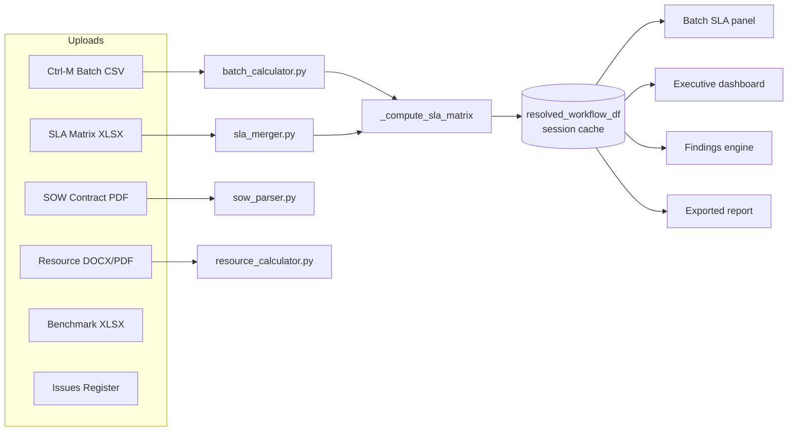
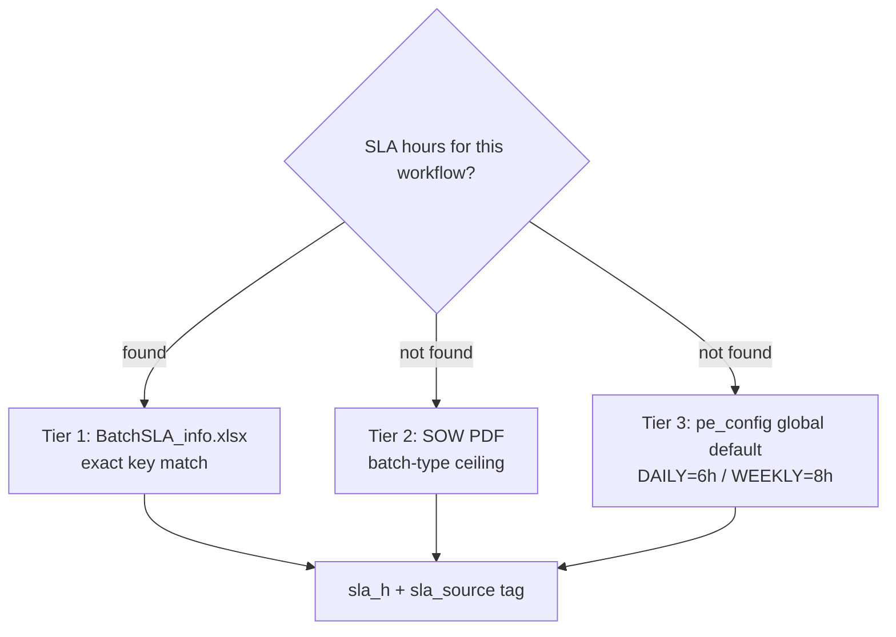
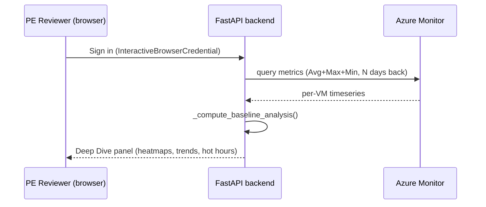
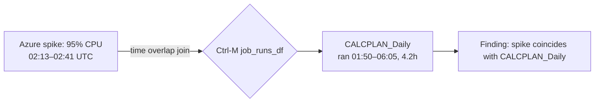

<!-- 
HOW TO USE THIS FILE
1. Install the "Marp for VS Code" extension → open this file → click "Open Preview
   to the Side" to present directly, or use the Marp status-bar icon → Export to
   PPTX/PDF (needs the Marp CLI, one-time: npm install -g @marp-team/marp-cli).
2. Or just copy each "---"-separated section into PowerPoint manually — the
   headings/bullets below map 1:1 to slide title/body.
3. Speaker notes are the italic lines starting with "Talk track:" under each
   slide — delete before printing, keep for delivery.
-->

# PE Audit Dashboard
### Architecture, Formulas & Azure-Correlated SLA Intelligence

A single source of truth for Performance Engineering audits across 250–300
customer engagements.

*Talk track: open by framing this as "how we replaced a manual, spreadsheet-driven
audit with one deterministic pipeline that never disagrees with itself."*

---

## Agenda

1. The problem this replaces
2. Tech stack
3. Architecture — one pipeline, six data pillars
4. SLA resolution logic + the buffer formula
5. Job exclusion, concurrent-job handling, false-signal negation, cyclic/multi-SLA batches
6. Pulling & correlating Azure resource metrics
7. Cross-source correlation formulas (RFCS / SRI / JRTOS / CRS / OSHS)
8. SOW contract vs. actual volume
9. Findings engine (automated audit rules)
10. Governance, export & sign-off
11. Roadmap / Q&A

---

## The Problem

- Legacy process: a Streamlit monolith + manual cross-referencing of Ctrl-M
  exports, SLA spreadsheets, SOW PDFs, and Azure portal screenshots
- Every customer has **different DFU/SKU/SLA values** — no two engagements
  are alike, so hardcoded thresholds silently produce wrong verdicts
- Metrics were **recomputed independently on each screen** → two panels could
  show two different compliance numbers for the same job
- No repeatable link between "batch job breached its window" and
  "the VM was under CPU/memory pressure at that exact time"

*Talk track: this is the "why" slide — it justifies the single-source-of-truth
design and the correlation formulas that follow.*

---

## Tech Stack

| Layer | Technology |
|---|---|
| Backend | FastAPI + Python 3.14, Pydantic v2 |
| Frontend | Vanilla JS (ES2020+), Tailwind v3, Chart.js + Plotly.js |
| AI (optional) | Google Gemini (narrative generation, findings text) — toggleable, deterministic engine works with it fully off |
| Azure | `azure-identity`, `azure-monitor-query`, `azure-mgmt-compute/resource/subscription` |
| Data processing | pandas, numpy, openpyxl, PyMuPDF, python-docx, pypdf |
| Persistence | Flat JSON (`.pe_config.json` thresholds, `.pe_cache.json` session) — no external DB dependency |

*Talk track: no framework lock-in on the frontend, no DB server to provision —
the whole tool runs from one Python process, easy to deploy per-engagement.*

---

## Architecture — One Pipeline, Six Data Pillars

**Rule: every screen reads from `resolved_workflow_df`. No screen recomputes
its own metrics.** This is the single fact that prevents panel-to-panel
disagreement.

---

## Six Data Pillars

| Pillar | Source file | What it contributes |
|---|---|---|
| Batch | Ctrl-M CSV | Job runtimes, start/end, failures |
| Resource | DOCX/PDF fleet report | CPU/mem/disk per server |
| SLA Matrix | XLSX (BatchSLA_info) | Contracted SLA hours per workflow — **Tier 1** |
| SOW Contract | PDF | Contracted DFU/SKU volumes, batch-window ceilings — **Tier 2** |
| Benchmark | XLSX | Transaction/UI performance thresholds |
| Issues Register | XLSX/CSV | Open tickets cross-referenced against findings |

*Talk track: each pillar is optional — the dashboard degrades gracefully and
tells the PE reviewer exactly which pillar is missing, rather than guessing.*

---

## SLA Resolution — Tiered, Never Hardcoded

- Every workflow key is normalized before lookup:
  `_norm(name)` = strip environment prefix (`PROD_`/`TEST_`/`UAT_`/`DEV_`/`STG_`)
  → uppercase. Same function mirrored in JS as `_normWf()` — a single naming
  convention across backend and frontend.
- **Every value carries provenance**: `sla_source`, `reason_code`,
  `debug_runtime_source` — a reviewer can always see *why* a number is what it is.
- **Tier 1 is externally verified** across real customer engagements —
  matches every hand-checked row. **Tier 2 (SOW PDF ceiling) is designed and
  wired, but not yet empirically validated** — every real engagement
  reviewed so far showed "No SOW contract uploaded yet," so this fallback
  path has never actually been exercised against a live SOW PDF. State it at
  that confidence level, not the same as Tier 1, until it has been.

---

## The Buffer Formula (used everywhere)

> **bufferPct = (SLA hours − runtime hours) ÷ SLA hours × 100**

**Worked example**: SLA = 6h, job actually ran 4.5h
→ `(6 − 4.5) / 6 × 100` = **25% buffer** → LONG_JOB (see table below)

| Condition | Status |
|---|---|
| `buffer_pct > 40%` | **OK** |
| `15% < buffer_pct ≤ 40%` | **LONG_JOB** (getting close) |
| `0% < buffer_pct ≤ 15%` | **AT_RISK** |
| `buffer_pct ≤ 0%` | **BREACH** |

- Thresholds (`SLA_ATRISK_PCT=15`, `SLA_LONGJOB_PCT=40`) live in **one file**
  (`pe_config.py`) — every consumer (SLA matrix, compliance engine, findings
  engine, frontend legend) reads the same constant, never a hardcoded copy.
- Zero/missing SLA guard (`routers/sla_matrix.py`): `sla_hrs <= 0` never
  computes a buffer number at all — `buffer_pct = None`,
  `reason_code = "SLA_MISSING"`. A data-integrity gap is surfaced as
  **missing data**, never silently manufactured into a BREACH verdict.
- **This guard only catches literal-zero SLA.** A real, nonzero-but-tiny SLA
  (e.g. a 10-minute/0.167h Tier-1 ceiling) passes the guard and can still
  produce implausible-looking magnitudes (e.g. a job seen at −3713% buffer
  on a real customer dashboard) — mathematically correct given the inputs,
  but a value that large is itself a signal the Tier-1 SLA entry deserves a
  second look, not evidence of a display bug. Not yet capped/flagged
  separately from an ordinary breach.

---

## Which Jobs Get Excluded From Analysis — and Why

Every exclusion is **named and surfaced to the reviewer** (`_build_excluded_jobs_list()`
+ the `excluded_jobs`/`excluded_sub_apps` payload) — nothing is silently dropped.

| Exclusion | Mechanism | Verified |
|---|---|---|
| **User-picked jobs** | `config_store["exclude_jobs"]` — analyst opts a job out by name | applies to SLA analysis only; raw file/heatmap still shows it |
| **Utility/infra jobs** | `is_utility_job()` — name-token match (`batch_start`, `enable_users`, `zabbix_monitors`, …) either always-excluded or runtime-gated (e.g. `pre_batch_node` only excluded if it ran < 2 min) | ✅ tested: `BATCH_START_NODE` at 0.01h → excluded; `CALCPLAN_Daily` at 4.2h → kept |
| **Cyclic/polling jobs** | `detect_cyclic_subs()` — median > 5 runs/day **and** avg runtime < 15 min (`CYCLIC_MAX_RUNTIME_HRS`) | ✅ tested: a 24-run/day, 2-min job flagged cyclic |
| **Retry storms — NOT excluded, flagged instead** | Same detector deliberately does **not** treat a 200-run spike on one bad day as cyclic — median stays ~1, so Guard 1 fails and it's tagged `RETRY_STORM` (surfaced as a warning, kept in the data) | ✅ tested: 200-run single-day spike correctly separated from the 24-run/day cyclic job |
| **Out-of-scope schedule types** | `MONTHLY/QUARTERLY/ADHOC/CYCLIC/OUTBOUND/PIPELINE_STAGE/CALENDAR_BASED` sub-apps are dropped from the **window-compliance denominator** (they never had a daily SLA window) — but still counted for job-level breach/anomaly checks | matches architecture doc |
| **Adaptive-SLA quality gate** | `SHORT_JOB` (avg < 5 min) and `INSUFFICIENT` (< 3 runs) baselines are excluded from **compliance %**, not from the job list — still visible, just not scored | code-verified |

*Talk track: "excluded" never means "hidden" in this dashboard — it means
"removed from a specific denominator, for a stated reason, with the reason
visible in the UI."*

---

## SLA After Upload — Exact Join First, Then Adaptive Fallback

**Step 1 — Tier 1 join** (`routers/sla_matrix.py`, on BatchSLA_info.xlsx upload):
1. **Exact match** — normalized workflow key (`_norm()`) hits the XLSX row directly
2. **Anchor match** — the XLSX's `First_Job`/`Last_Job` sentinel names anchor a
   Ctrl-M sub-app to its workflow even if the sub-app name itself doesn't match
3. **Token match** — remaining unmatched workflows fall back to a token-overlap
   fuzzy match
4. **Collision guard** — if two different workflows would share the same
   stripped secondary key (e.g. `PETBARN_DAILY` and `TESCO_DAILY` both reducing
   to `DAILY`), that secondary key is **skipped entirely** rather than
   last-writer-wins silently assigning the wrong SLA to one of them

**Step 2 — sentinel-restricted window** (not naive min/max):
- The wall-clock window opens at the **earliest** First_Job run and closes at
  the **latest** Last_Job run (`.min()`/`.max()` respectively — deliberately
  asymmetric so a Last_Job that fires from several parallel sub-workflows
  doesn't truncate the window early)
- Prevents pre-batch file-prep jobs from inflating the measured window

**Step 3 — if no XLSX is uploaded at all (PATH C, adaptive)**:
> Per job, from Ctrl-M run history alone: `STRONG` (≥14 OK runs) → p95 runtime · `MODERATE` (7–13) → max(p90, avg+2σ) · `WEAK` (3–6) → a blended peak/variance estimate · `INSUFFICIENT` (<3) → best-guess peak, excluded from compliance · always capped at the schedule's global ceiling.

✅ **Tested**: 20 synthetic runs at ~4.0–4.4h → correctly classified `STRONG`,
`sla_hrs = 4.4` (p95), capped under the 6h global ceiling supplied.

⚠️ **Real bug found and fixed this session, on a real customer file**: uploaded
USF's actual `BatchSLA_info.xlsx` (clock-time columns like `Start Time` =
"Sunday 9:05 PM CST", `Expected End Time/SLA` = "6AM CST" — no numeric SLA
column). Every one of 11 workflows showed a generic `17h` (WEEKLY) or `6h`
(DAILY/PERIODIC) instead of its real contracted window. Root cause: the
overnight-delta parser never stripped the day-of-week name from `Start Time`
before calling `pd.to_datetime()`, so `"Sunday 9:05 PM"` parsed to `NaT` for
**every single row**, and the parser silently fell through to the Tier-3
generic default for all 11 workflows — discarding real, computable per-workflow
windows that were sitting right there in the same file.
- **Fixed**: strip the day-name prefix before parsing. Re-ran the real file:
  **8 of 11 workflows now resolve to their genuine file-derived windows**
  (8.92h, 14.0h, 2.0h — not 17h/6h), correctly tagged
  `sla_source = BATCH_SLA_XLSX`. The remaining 3 correctly still use the
  default — their `Expected End Time` is literally `"NA"` (genuinely cyclic,
  no fixed deadline stated), not a parse failure.
- **Verified no regression**: ran the existing SLA test suite against both
  the old and new code (git-stash A/B test) — identical 12-pass/5-fail
  baseline both times (those 5 are pre-existing, unrelated). 4 other SLA
  regression suites (`dominant_ceiling`, `window_compliance_regression`,
  `windows_denominator_shared`, `anchor_match`) all still pass clean.

*Talk track: the dashboard never falls back to "one global SLA for every job"
— even with zero uploads, every job gets its own history-derived ceiling. And
when the answer WAS wrong, it was wrong the same honest way for every
affected row — which made the root cause traceable to one function.*

---

## Concurrent & Overlapping Jobs — Busy-Time, Not a Naive Sum

A day's "batch window" is not `sum(runtimes)` and not `last_end − first_start`
either — both overstate reality when jobs run in parallel or in separated
clusters.

- **`_merge_intervals()`**: unions all job `[start, end]` pairs for the day.
  Two jobs that ran 01:00–02:00 and 01:30–03:00 in parallel count as **2h of
  real busy time**, not 3h.
- **Block detection**: runs separated by more than `BATCH_BLOCK_GAP_HRS` are
  reported as **separate batch blocks** (e.g. a morning phase and an evening
  phase) instead of one artificially long elapsed window spanning the idle gap
  between them.

✅ **Tested**: three overlapping/adjacent runs (01:00–02:00, 01:30–03:00,
04:00–04:30) → `busy_hrs = 2.5`, correctly the union, not the naive `3.5h` sum.

⚠️ **Important distinction**: this real interval-union logic is what powers
window-elapsed measurement. **CRS's "downstream count" is a different,
simpler thing** — it's `len(jobs in the same sub-application)`, a proxy for
blast radius, **not** a true dependency-graph traversal (Ctrl-M CSV exports
carry no job-precedence/dependency column, so a real cascade graph isn't
available to this pipeline). Worth stating plainly rather than implying CRS
models actual job dependencies.

---

## Negating False Signals From Ctrl-M

| Bad signal | How it's neutralized | Status |
|---|---|---|
| Midnight crossover (End < Start) | +24h correction before computing elapsed | code-verified |
| Corrupt timestamp pairs | Elapsed capped at 168h (1 week) | code-verified |
| Retry-storm inflating "cyclic" detection | Median (not max) run-count guard — see exclusion table above | ✅ tested |
| Zero/near-zero runtime after a real prior baseline | Batch-benchmark comparison (`BATCH_NOWORK_SEC`, `BATCH_COLLAPSE_RATIO`) flags a ≥95% runtime drop as an **implausible "improvement"** to investigate, not a genuine win | code-verified |
| Job peak/avg skewed by failed runs | Peak/avg computed from `Status == "OK"` rows only; FAILED runs are counted separately (`fail_count`) so they can't quietly drag down a peak-runtime metric | code-verified |
| Missing `Start_Time` column entirely | Falls back to `pd.Timestamp.now()` for every row | ⚠️ **real gap found this session** |

⚠️ **Real gap, not just a doc issue**: the frontend (`static/app.js`) has a
`⛔ SYNTHETIC TIMESTAMPS` badge gated on `data_coverage.has_synthetic_timestamps`
— but the backend's `data_coverage` payload (`services/batch_calculator.py`)
**never sets that field**. Grepped the whole repo: `has_synthetic_timestamps`
exists in exactly one place (the frontend check) and nowhere on the backend.
If a customer's Ctrl-M export has no parseable `Start_Time` column, every run
silently becomes "happened right now," the server logs a warning **nobody
sees**, no confidence penalty applies, and the promised UI badge can never
fire. This is dead code, not a working safety net — recommend wiring it
before presenting this row as a shipped protection.

---

## Multi-SLA & Cyclic vs. Non-Cyclic Batches

- **Schedule classification** (`classify_schedule()` / `detect_batch_type()`):
  `DAILY`/`WEEKLY`/`BIWEEKLY`/`MONTHLY`/`MONTHLY_WORKDAY`/`QUARTERLY`/`ADHOC`/
  `CYCLIC`/`OUTBOUND` — inferred from workflow name + schedule text, with a
  fixed detection priority (`ADHOC` checked before `DAILY` so compound names
  like `BIWEEKLY_ADHOC` resolve correctly).
- **Different SLA windows coexist honestly**: when more than one distinct
  resolved ceiling is in scope for a review, the dashboard tracks
  `window_inscope_ceiling_count` and changes the headline wording from a
  single "within the 6h window" claim to "each within its own ceiling
  (min–max)" — it does not force multiple real SLA windows into one
  misleading number.
- **Cyclic ≠ excluded from everything** — a cyclic sub-app is dropped from the
  *window-elapsed* measurement only (it would otherwise inflate the window to
  ~24h and manufacture a false 0% compliance day); its individual job runs
  are still counted for job-level breach/anomaly/failure-rate purposes.

---

## Pulling Azure Resource Metrics

- Auth: `InteractiveBrowserCredential` (no `DefaultAzureCredential` — banned,
  it hangs 30s+ probing IMDS on non-Azure machines). Sign in once, silently
  restored from a local auth-record cache on reload/restart.
- One Azure Monitor query per VM requests **AVERAGE + MAXIMUM + MINIMUM in a
  single call** for CPU / Memory / Disk / Data-Disk-Bandwidth — not three
  separate round trips.
- A brief spike that would average away to nothing over a 7/15/30-day window
  is preserved via the Max series — critical for catching short nightly-batch
  CPU spikes that a daily average hides.

---

## Azure Baseline Intelligence

`_compute_baseline_analysis()` turns raw timeseries into judgment-grade
evidence (needs ≥ 2 days of data, **15 days recommended**):

| Signal | What it detects |
|---|---|
| Hot hours | Consistent pressure at the same clock hour → batch fingerprint |
| Trend acceleration | Metric getting worse across the observation window |
| Weekday vs weekend divergence | Batch-driven load vs. steady-state load |
| Chronic pressure | High utilization for many consecutive days → undersized VM |
| Multi-day recurring spikes | Same hour spiking on N different days → definitive batch signature |
| Fleet-wide trend | Roll-up across all VMs for an executive verdict |

*Talk track: this is what upgrades a finding's evidence class from "inferred"
to "measured" — Azure telemetry corroborating a Ctrl-M-only observation.*

---

## Correlating Batch, SLA & Resource — 5 Formulas

`services/correlation_engine.py` — the cross-pillar math no single-source
tool can do, because it needs both Ctrl-M **and** Azure Monitor data:

| Formula | Meaning |
|---|---|
| **RFCS** (0–100) | Resource-Failure Correlation Score — how much resource stress lines up with job failures |
| **SRI** (0–∞) | SLA Risk Index per job — buffer distance amplified by CPU pressure |
| **JRTOS** (0–1, one score per hour-of-day bucket 0–23) | Job-Resource Temporal Overlap — which hour of day is riskiest |
| **CRS** (0–1) | Cascade Risk Score — likelihood a breach cascades downstream |
| **OSHS** (0–100 → A–F) | Overall System Health Score — executive-dashboard grade |

⚠️ **Calibration caveat**: across the real engagements reviewed so far
(failure rates consistently <1%, average CPU consistently <5%), RFCS and
SRI's amplification terms rarely activate — both formulas were designed
assuming a wider input range than this Ctrl-M/Oracle batch workload class
actually produces. On this class of engagement they may not discriminate a
0.1%-failure customer from a 3%-failure one as clearly as the "0–100"/CPU-
amplified framing implies. Worth validating against a heavier-load
engagement before presenting either as a differentiated signal to a customer.

---

## Formula Detail (with the clamps that actually ship)

**RFCS** — Resource-Failure Correlation Score
> `RFCS = cap100( failureRate × (0.6×avgCPU + 0.4×avgMem)/100 × (1 + 0.15×min(criticalServers,10)) )`
- `failureRate` is a **percentage** (`100 − compliance_pct`), not a fraction.
- Example: 20% failure rate, avgCPU=85, avgMem=70, 3 critical servers
  → weighted pressure = `0.6×85 + 0.4×70 = 79` → `20 × 79/100 = 15.8` →
  amplifier `1 + 0.15×3 = 1.45` → `15.8 × 1.45 = 22.9` → **RFCS ≈ 23**
- Raw value can reach ~250 before the `cap100(...)` clamp caps it at 100.

**SRI** — SLA Risk Index (per job)
> `SRI = (peakHours / slaCeilingHours) × (1 + max(0, (avgCPU−70)/100))` — `>1.0` = breach
- `peakHours / slaCeilingHours` is algebraically `1 − bufferPct/100` — SRI
  deliberately **reuses** the same buffer fact (amplified by CPU pressure),
  it is not a second independent computation that could silently disagree.
- Example: job ran 5h against a 6h ceiling, avgCPU=85
  → `5/6 = 0.833` × `(1 + max(0,0.15)) = 1.15` → **SRI ≈ 0.96** (still under 1.0)

**CRS** — Cascade Risk Score (per job)
> `CRS = cap1( failedFlag × (downstreamCount/(downstreamCount+5)) × (1 − clamp(slaBuffer,0,100)/100) )`
- `slaBuffer` is clamped to `[0,100]` **before** use — a −200% (deep breach)
  buffer becomes `0`, not a negative that would push CRS past 1. The final
  result is clamped again to `≤ 1`.
- Example: job failed, 8 downstream jobs, buffer was −200% (deep breach)
  → chain factor `8/13 = 0.615` × buffer risk `1 − 0/100 = 1.0` → **CRS ≈ 0.62**
- **Verified against a real worst-case row** (a job at −3713.1% buffer):
  `calc_crs(True, 8, -3713.1)` returns the **same 0.615** as a −20% breach
  with the same downstream count. The clamp fixes boundedness completely,
  but as a side effect **CRS can't distinguish "barely breached" from
  "catastrophically breached"** — every breach past 0% buffer maxes out the
  buffer-risk term identically. Chain size is the only thing still varying
  CRS between two failed jobs.

**OSHS** — Overall System Health Score (executive grade)
> `OSHS = 0.40×batchScore + 0.35×slaScore + 0.25×resourceScore`
- Weights re-normalize over batch+SLA only (→ 0.53/0.47 proportional) when
  no resource data exists — **never fabricates** a resource score.

**JRTOS** — Job-Resource Temporal Overlap (per hour-of-day bucket, 0–23)
> `JRTOS[h] = (jobs[h]/maxJobsInAnyHour) × (failRate[h]/100) × (peakCPU/100)`
- All three factors are ratios in `[0,1]`, so `JRTOS[h]` is naturally bounded
  to `[0,1]` — no clamp needed. The "0–23" in the summary table is the
  **hour index** (24 buckets/day), not the score's range — a labeling
  ambiguity now fixed above.
- Example: hour 2am has 12 jobs (busiest hour, so `jobs/max=1.0`), 2 of
  those failed (`failRate=16.7%`), peak CPU that hour was 40%
  → `1.0 × 0.167 × 0.40` → **JRTOS(2am) ≈ 0.067**

*Talk track: every formula here is clamped at both ends in code — the deck
now states the clamps and a worked example for each, instead of leaving the
math abstract.*

---

## Spike-to-Batch Attribution (the unique correlation)

For every Azure Monitor spike (critical / critical-sustained / warning
severity only), find which Ctrl-M jobs were **running during that exact
window**:

- Join condition: `run.start < spike.end AND run.end > spike.start`
- Explicitly labeled **time-coincidence, not host-pinned causation** — Ctrl-M
  exports carry no host column today. Ranked by job runtime, top-N surfaced
  per spike.
- *(Upgrade path already scaffolded: once a job→VM map exists, the same join
  narrows to genuine host-pinned causation with one filter added.)*

---

## SOW Contract vs. Actual Volume

- SOW PDF parsed for contracted **DFU/SKU/order volumes** and **batch-window
  ceilings** (Gemini-assisted extraction with hard bounds validation: SLA
  windows 0.5–48h, volumes 1–50M, availability 90–100% — out-of-range values
  are rejected, never silently accepted).
- Actual volume (from Batch/manual entry) compared against the SOW baseline:

> **pct = actual ÷ SOW contracted × 100**

**Worked example**: SOW contracted = 500,000 DFU/day, actual = 265,000
→ `265,000 / 500,000 × 100` = **53% → LOW**, under-utilized vs. contract

Evaluated in strict order (first match wins — never double-fires):

| Order | Condition | Status |
|---|---|---|
| 1 | `> SOW_OVER_CRIT_PCT` | **CRITICAL_OVER** — blocks PE sign-off without disclaimer |
| 2 | `> SOW_OVER_PCT` | **OVER** |
| 3 | `< SOW_UNDER_PCT` | **LOW** — under-utilized vs. contract |
| 4 | `< 90%` (remaining) | **ACCEPTABLE** — inside window, lower end |
| 5 | else | **OPTIMAL** — preferred zone |

✅ **Fixed**: the `90%` boundary is now `pe_config.SOW_ACCEPTABLE_PCT` — a
named, config-store-backed constant (`sow_acceptable_pct`), not a hardcoded
literal. It was previously duplicated as a raw `90` in 5 places
(`routers/sow.py`, `routers/export.py`, `routers/findings.py`,
`routers/pe_narrative.py`, `static/app.js`) — all five now read the same
constant. Verified the strict `if/elif` order never produces a gap or
overlap even when `SOW_UNDER_PCT` is configured above 90 (mutation-tested).

*Talk track: this is what tells a customer "you're running 53% under your
contracted daily volume" or "you've exceeded scope and need a change order."*

---

## Findings Engine — 14 Automated Rule Sections

1. Data confidence / audit coverage
2. Batch rules (R0–R8): compliance, window breach, buffer, anomalies
3. Resource rules: fleet grade, CPU/mem/disk pressure bands
4. Cross-source: batch breach + CPU pressure correlation
5. SLA Matrix: per-run, tightest buffer, repeat offenders
6. Benchmark: threshold breaches, worst transactions
7. SOW compare: exceeded / under / optimal
8. Regression: z-score > 2σ critical, 1.5–2σ drift warning
9. Adaptive SLA: p95 within 10% of ceiling
10. Issues register cross-reference
11. Intelligence (A1–A10): misleading-green detection, waiver detection, contradictions
12. Narrative + open audit gaps

*Talk track: every rule cites its evidence — a job name, a number, a
timestamp — never a generic "performance issue detected."*

---

## Governance, Export & Sign-off

- PE reviewer checklist gates sign-off on data completeness
- Blockers can be overridden with an explicit, logged disclaimer — never
  silently bypassed
- One-click **HTML report export**: pulls Batch, Resource, SLA, SOW,
  Benchmark, Findings, and Approval sections from the same
  `resolved_workflow_df` / session cache the live dashboard uses — the report
  a customer receives is provably the same numbers the reviewer saw on screen

---

## Roadmap / Q&A

- Host-pinned spike attribution (once job→VM mapping is available)
- Wider AI narrative coverage (Findings/Executive Summary sections in export)
- Additional Azure metrics (already extensible — one query call per metric group)

### Questions?
