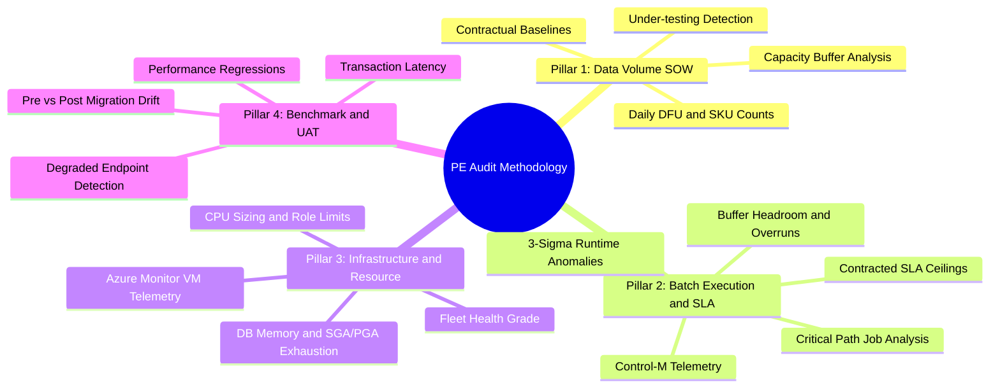
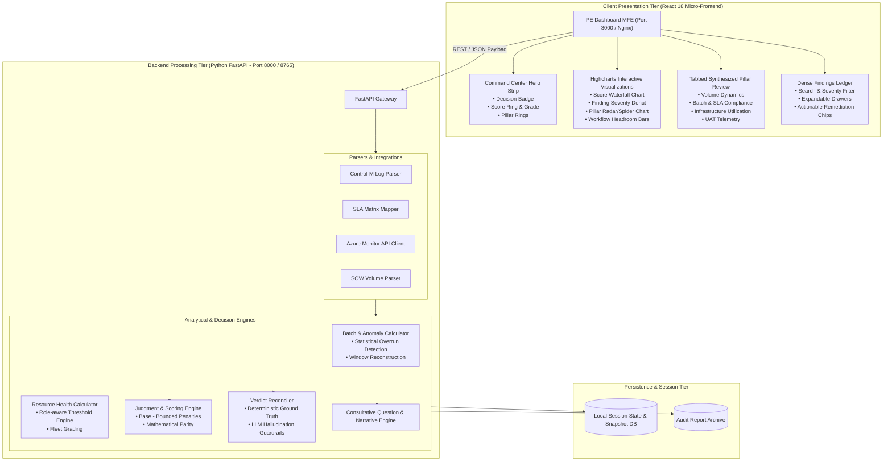
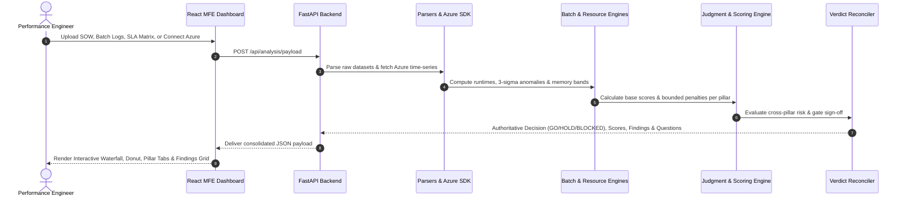

# Performance Engineering (PE) Audit & Intelligence Dashboard

[](#system-architecture)
[](#tech-stack--engineering-design)
[](#tech-stack--engineering-design)
[](#deterministic-judgment--scoring-engine)

---

## Table of Contents
1. [Executive Overview & Purpose](#executive-overview--purpose)
2. [The Problem & Automation Impact (ROI)](#the-problem--automation-impact-roi)
3. [The 4 Core Evaluation Pillars](#the-4-core-evaluation-pillars)
4. [System Architecture](#system-architecture)
5. [Tech Stack & Engineering Design](#tech-stack--engineering-design)
6. [Data Pipeline & Cross-Pillar Synthesis](#data-pipeline--cross-pillar-synthesis)
7. [Deterministic Judgment & Scoring Engine](#deterministic-judgment--scoring-engine)
8. [Repository & Deployable Boundaries](#repository--deployable-boundaries)
9. [Local Development & Quick Start](#local-development--quick-start)
10. [Verification & Testing](#verification--testing)

---

## Executive Overview & Purpose

The **Performance Engineering (PE) Dashboard** is an enterprise-grade analytics, audit, and decision-support platform built for supply chain planning and execution systems. It synthesizes operational execution logs, contractual commitments, cloud infrastructure telemetry, and benchmark data into an authoritative, single-pane sign-off verdict (`GO`, `HOLD`, `BLOCKED`, `REMEDIATE`).

The system serves as the definitive engineering gatekeeper before customer go-live, major quarterly releases, or infrastructure migrations, ensuring that signed Service Level Agreements (SLAs), data volumes, and server health guarantees are mathematically proven and defensible.

```
+-----------------------------------------------------------------------------------+
|                            PE AUDIT COMMAND CENTER                                |
|  Decision: BLOCKED | Score: 88 (Grade: B) | SOW: PASS | BATCH: REVIEW | INFRA: OK |
+-----------------------------------------------------------------------------------+
       |                          |                         |                  |
       v                          v                         v                  v
+--------------+          +---------------+         +---------------+   +--------------+
| 1. SOW Scope |          | 2. Batch/SLA  |         | 3. Azure VM   |   | 4. Benchmark |
| Data Volume  |          | Window & Head |         | CPU, Mem, SGA |   | UAT & Drift  |
+--------------+          +---------------+         +---------------+   +--------------+
```

---

## The Problem & Automation Impact (ROI)

### The Manual Bottleneck (Before)
Prior to this automation platform, conducting a comprehensive PE audit for an enterprise customer required extensive manual effort across siloed data sources:
- **Disparate Data Silos**: Manually cross-referencing tens of thousands of Control-M execution rows, signed SOW legal PDFs, Excel SLA matrices, Azure Monitor metric exports, and Jmeter/UAT telemetry.
- **Cognitive Overload & Human Error**: Calculating SLA window overlaps, identifying 3-sigma statistical runtime anomalies, and matching multi-day batch peaks against contracted limits in spreadsheets took **3 to 5 performance engineers between 4 and 10 business days per engagement**.
- **Inconsistent Decision Criteria**: Different engineers applied varying subjective thresholds for go-live approvals, leading to missed near-breach conditions (e.g. workflows running at 96% window capacity with only minutes of headroom).

### The Automated Platform (After)
| Dimension | Manual Process | Automated PE Dashboard | Impact / ROI |
| :--- | :--- | :--- | :--- |
| **Audit Turnaround** | 4 to 10 days | **< 30 seconds** | **~99% time reduction** |
| **Data Ingestion** | Manual copy-paste into Excel | Instant multi-source parser (JSON, CSV, XLS, Azure API) | Eliminates transcription errors |
| **SLA Window Headroom** | Coarse estimation of worst runs | Exact per-run timeline reconstruction & buffer calculation | Catches thin-margin risks |
| **Cross-Pillar Correlation** | Rare / ad-hoc manual correlation | Automated correlation (e.g. batch peak mapped to DB CPU spike) | Instant root-cause identification |
| **Customer Questionnaire** | Written manually from scratch | Dynamically generated consultative questions by severity | Standardized executive review |
| **Decision Authority** | Subjective opinion | **Deterministic, mathematically bounded verdict** | Zero-hallucination sign-off |

---

## The 4 Core Evaluation Pillars

The platform evaluates system readiness across four comprehensive, interconnected pillars:



### 1. 📦 SOW Data Volume Analysis
- Compares actual ingested records (e.g., Daily DFU, Daily SKU Count) against contracted SOW baseline targets.
- Computes **Capacity Buffer %** and flags both growth overruns (>110%) and severe under-testing (<40%, indicating the customer has not tested the system at production scale).

### 2. ⚙️ Batch Execution & SLA Compliance
- Ingests Control-M execution telemetry (e.g., 1,800+ runs across dozens of distinct jobs).
- Evaluates sub-application workflows (`DAILY`, `WEEKLY`, `DAYTIME`, `MONTHLY`) against contracted SLA ceilings (e.g., 11.0h daily limit vs 13.0h weekly window).
- Computes real-time **Buffer Headroom minutes**, flags execution failures, and identifies recurring failures and 3-sigma duration spikes.

### 3. 🖥️ Infrastructure Utilization & Resource Health
- Pulls Azure VM metrics (CPU %, Memory %, Disk I/O) across App, DB, and Integration tiers.
- Enforces role-aware thresholds (e.g. DB Memory 80–92% expected band for SGA/PGA; >92% flagged for paging/OOM risk).
- Assigns fleet health grades (A through F) and pinpoints memory leaks or under-provisioned virtual hardware.

### 4. 🧪 Performance Benchmarking & UAT Validation
- Analyzes UAT load tests and pre- vs post-release runtime comparisons.
- Identifies degraded transactions, query execution regressions, and latency drift before production deployment.

---

## System Architecture

The solution uses a **Decoupled Micro-Frontend (MFE) + High-Performance Python API** architecture designed for standalone execution as well as seamless embedding within the Blue Yonder Luminate / Stratosphere portal.



---

## Tech Stack & Engineering Design

```
+-----------------------------------------------------------------------------------+
|                                TECH STACK MATRIX                                  |
+-----------------------------------------------------------------------------------+
| Tier         | Technology                           | Role                        |
+--------------+--------------------------------------+-----------------------------+
| Frontend     | React 18, TypeScript (Strict Mode)   | UI Component Architecture   |
| Design       | Material-UI v4, Custom Dark Theme    | Accessible Component System |
| Charts       | Highcharts, Highcharts-More, Gauge   | Interactive Data Visuals    |
| State        | React Context API (AppDataContext)   | Single Store Data Model     |
| Backend      | Python 3.11+, FastAPI                | Asynchronous Processing API |
| Data Engines | Pandas, NumPy, Pydantic              | High-Throughput Crunching   |
| Cloud SDK    | Azure Monitor Metrics SDK            | Live Telemetry Integration  |
| Deployments  | Docker, Docker Compose, Nginx        | Cloud & Local Deployable    |
+-----------------------------------------------------------------------------------+
```

### Frontend Highlights
- **Micro-Frontend Architecture**: Engineered with webpack module boundaries, easily mountable inside host portals (Luminate Portal / Stratosphere) or runnable as a standalone command center.
- **Custom Dark Theme System**: Designed with a high-contrast palette (`#060914` canvas, `#0d1526` surface cards, `#213060` borders, `#10d96e` OK, `#f59e0b` Warning, `#f43f5e` Critical).
- **High-Density Information Architecture**: Strict 6-level typography scale (10px–20px) with collapsible data drawers, keeping complex multi-day audits scannable in one viewport.

### Backend Highlights
- **High Performance Async Endpoints**: Non-blocking FastAPI routes handling multi-megabyte log parsing in sub-second runtimes.
- **Deterministic AI Architecture**: LLM features are gated by strict deterministic validators (`verdict_reconciler.py`). If generated text contradicts empirical batch numbers, the deterministic truth automatically overrides the AI output.

---

## Data Pipeline & Cross-Pillar Synthesis



---

## Deterministic Judgment & Scoring Engine

The scoring system uses a **Base Score minus Bounded Penalties** mathematical formulation:

$$\text{Pillar Score} = \max\left(0, \text{Base} - \sum \min(\text{Penalty}_i, \text{Cap}_i)\right)$$

$$\text{Composite Score} = \sum_{p \in \text{Pillars}} \left(\text{Score}_p \times \text{Weight}_p\right)$$

### Sign-off Gating Hierarchy
1. **Critical Blocker Rule**: If any unresolved `CRITICAL` finding exists (e.g. database RAM exhaustion or negative window buffer), the top-level decision is strictly **`BLOCKED`** or **`HOLD`**, regardless of composite numerical score.
2. **Grade Mapping**:
   - `A / A+` (Score $\ge 90$): **`GO`** — All pillars compliant, healthy buffer margins.
   - `B / B+` (Score $75 - 89$): **`GO WITH NOTES`** / **`HOLD`** — Minor risks under review.
   - `C / D / F` (Score $< 75$ or Criticals): **`BLOCKED`** / **`REMEDIATE`** — Immediate remediation required before production deployment.

---

## Repository & Deployable Boundaries

```text
PE_Dashboard/
├── backend/
│   ├── PE_Dashboard_API/            # Core FastAPI production backend
│   │   ├── app/
│   │   │   ├── routers/             # API Endpoints (findings, batch, resource, judgment, etc.)
│   │   │   ├── services/            # Calculation & Judgment Engines
│   │   │   └── main.py              # Application entry point
│   │   └── Dockerfile               # Production API Docker container definition
│   ├── legacy-ui/                   # Local legacy comparison UI (FastAPI Jinja templates)
│   └── start-api.bat                # Local API launcher
├── frontend/
│   ├── PE_Dashboard_MFE/            # Production React 18 Micro-Frontend
│   │   ├── source/
│   │   │   ├── src/
│   │   │   │   ├── components/
│   │   │   │   │   ├── panels/      # Hero card, Tabbed pillar summary, Uploads
│   │   │   │   │   └── shared/      # Waterfall, Donut, Radar, DataGrid, Headroom widgets
│   │   │   │   ├── theme/           # Highcharts theme, CSS & Design tokens
│   │   │   │   └── context/         # AppDataContext store
│   │   │   └── package.json
│   │   └── Dockerfile               # Nginx MFE container definition
│   └── start.bat                    # Local React MFE launcher
├── other/                           # Architectural guides & handoff documentation
├── docker-compose.yml               # Two-container orchestration (API + MFE)
└── README.md                        # Project architecture & engineering guide
```

---

## Local Development & Quick Start

### Prerequisites
- **Node.js**: v18+ and `npm`
- **Python**: v3.11+
- **Docker**: (Optional) For containerized execution

### 1. Starting Backend API
```powershell
# Option A: Helper script
.\backend\start-api.bat

# Option B: Direct uvicorn
cd backend\PE_Dashboard_API
python -m uvicorn app.main:app --host 127.0.0.1 --port 8000 --reload
```
API Documentation will be available at: `http://127.0.0.1:8000/docs`

### 2. Starting React Micro-Frontend (MFE)
```powershell
# Option A: Helper script
.\frontend\start.bat

# Option B: Direct npm
cd frontend\PE_Dashboard_MFE\source
npm install
npm run start:standalone
```
Dashboard will be available at: `http://127.0.0.1:3000`

### 3. Running with Docker Compose
```powershell
docker-compose up --build
```

---

## Verification & Testing

### Frontend Test Suite (Jest + React Testing Library)
```powershell
cd frontend\PE_Dashboard_MFE\source
# Run all 19 test suites
npm test -- --watchAll=false
# TypeScript compilation check (0 errors)
npx tsc --noEmit
```

### Backend Scoring Validation Suite
```powershell
# Validates mathematical parity and boundary penalty caps
python _test_final_judgment_scoring.py
```

---

## License & Ownership
Proprietary supply chain performance engineering asset developed for Blue Yonder / ASRE Cloud Delivery and Performance Engineering teams.

