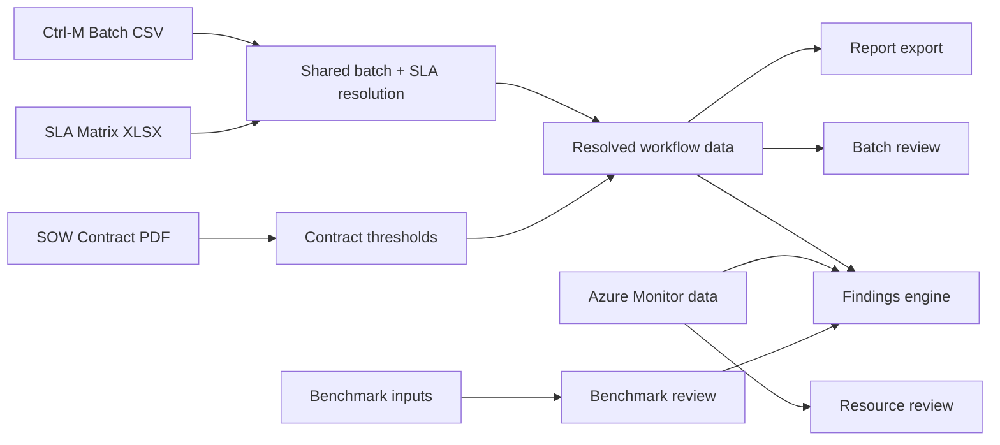
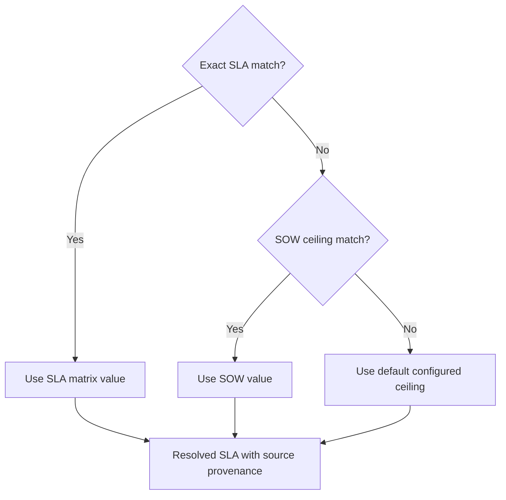

# PE Audit Dashboard
### Single source of truth for batch, SLA, SOW and Azure review

A structured performance engineering review workflow that turns scattered evidence into one traceable decision trail.

*Talk track: start with the problem we solved: manual review across spreadsheets, Ctrl-M exports, SLA matrices, SOW documents and Azure screenshots.*

---

## Why this matters

- PE analysis was historically fragmented across multiple files and screens
- Different teams could compute the same metric differently
- Batch risk, SLA breach and infrastructure pressure were often reviewed separately
- The real question was not just “what failed?” but “what failed at the same time, under the same pressure, and why does it matter?”

**Outcome:** one review model, one evidence trail, one exportable customer-ready report.

---

## What the dashboard brings together

- Ctrl-M batch job timings and execution patterns
- SLA matrix values and fallback logic
- SOW contract ceilings and volume benchmarks
- Azure resource metrics such as CPU, memory and disk stress
- Findings and exclusions with explicit reasoning

**Important:** resource and benchmark data are treated as independent evidence streams, then joined at the review layer rather than silently rewritten into the core batch truth.

---

## Core architecture

**Design principle:** the shared workflow data is the source of truth for batch + SLA story; resource evidence is layered on top as corroboration.

---

## SLA resolution and buffer logic

> bufferPct = (SLA hours − runtime hours) ÷ SLA hours × 100

| Condition | Result |
|---|---|
| failure / no valid completion | FAILED |
| `buffer_pct > 40%` | OK |
| `15% < buffer_pct ≤ 40%` | LONG_JOB |
| `0% < buffer_pct ≤ 15%` | AT_RISK |
| `buffer_pct ≤ 0%` | BREACH |
| missing / zero SLA | SLA_MISSING |

**Important:** missing SLA is treated as a data quality warning, not a silent breach.

---

## Job filtering and exclusion logic

Not every Ctrl-M job is a product-critical workload. The system separates:

- product-impacting jobs
- utility / housekeeping jobs
- cyclic or polling jobs
- out-of-scope schedules
- insufficient-history jobs

This is not hidden from the reviewer. Every exclusion is explicit and explainable.

Examples of noise removed from the core product view:
- file watcher / monitoring jobs
- backup / housekeeping jobs
- short-lived polling loops
- non-daily or non-relevant operational schedules

This keeps the review focused on the jobs that truly affect customer processing and SLA outcomes.

---

## Azure correlation adds operational context

- Azure Monitor captures CPU, memory and disk context for the environment
- The dashboard compares resource pressure against the exact job windows
- Correlation is based on time-overlap, not unsupported causation claims
- The deep dive also highlights recurring hot hours and short spikes that averages can hide

**Meaning:** the dashboard asks, “Did the workload and the infrastructure pressure occur together?” — not, “Did we prove a single, absolute cause?”

---

## Findings, evidence and export

The findings engine combines all relevant signals:

- batch health and SLA risk
- Azure pressure and recurring patterns
- SOW volume comparison
- benchmark thresholds
- explicit exclusions and confidence notes

**Export model**
- The report is generated from the same data used in the live review
- customer-facing output stays traceable to the evidence behind it
- sign-off is based on completeness and reviewability, not just a downloaded file

---

## Executive takeaway

The dashboard converts a fragmented audit workflow into a cleaner operational discipline:

- one shared batch/SLA truth
- explicit data exclusions
- measurable resource correlation
- evidence-backed findings
- exportable customer-ready reporting

This makes the review more defensible, more repeatable, and far easier to reuse in future audits.

---

## Roadmap

- stronger host-level attribution when job-to-VM mapping is available
- clearer confidence labeling on every finding
- more resource metrics and trend summarization
- tighter executive report styling for customer distribution

### Questions?
